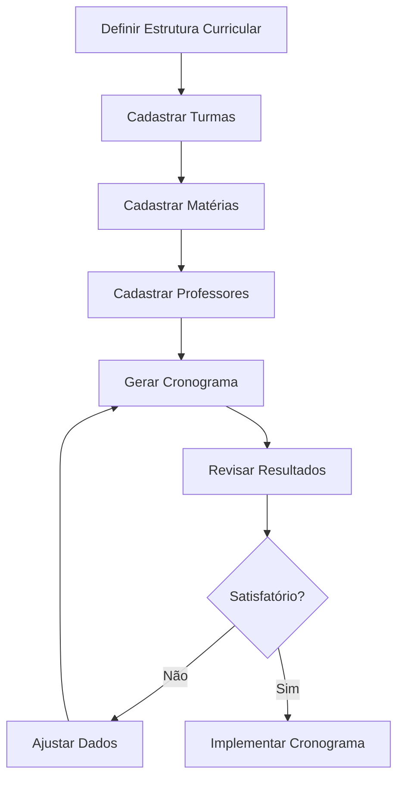

# 🕐 EdChronos - Sistema de Gestão de Cronogramas Escolares

**Plataforma integrada para otimização algorítmica de scheduling pedagógico**

---

## 📋 Índice

- [Visão Geral](#-visão-geral)
- [Para Quem é Este Sistema](#-para-quem-é-este-sistema)
- [Acesso à Aplicação](#-acesso-à-aplicação)
- [Funcionalidades Principais](#-funcionalidades-principais)
- [Manual de Uso Detalhado](#-manual-de-uso-detalhado)
- [Fluxo de Trabalho Recomendado](#-fluxo-de-trabalho-recomendado)
- [Dicas e Boas Práticas](#-dicas-e-boas-práticas)
- [Resolução de Problemas](#-resolução-de-problemas)
- [Suporte Técnico](#-suporte-técnico)

---

## 🎯 Visão Geral

O **EdChronos** é um sistema web desenvolvido para automatizar e otimizar a criação de cronogramas escolares. Utilizando algoritmos inteligentes de alocação, o sistema resolve um dos principais desafios da gestão educacional: distribuir adequadamente professores, matérias e horários sem conflitos.

### Principais Benefícios:
- ⚡ **Automação Total**: Gera cronogramas em segundos
- 🎯 **Zero Conflitos**: Evita sobreposição de horários de professores
- 📊 **Otimização Inteligente**: Distribui cargas horárias de forma equilibrada
- 🎨 **Interface Intuitiva**: Fácil de usar, mesmo sem conhecimento técnico
- 📱 **Acessível**: Funciona em computadores, tablets e smartphones

---

## 👥 Para Quem é Este Sistema

### **Coordenadores Pedagógicos**
- Cadastro e gestão de turmas e períodos
- Definição de cargas horárias por disciplina
- Supervisão da distribuição curricular

### **Diretores/Gestores**
- Visão geral da organização escolar
- Otimização de recursos humanos
- Redução de tempo gasto em planejamento manual

### **Secretários Acadêmicos**
- Cadastro de professores e suas especialidades
- Manutenção de dados institucionais
- Geração de relatórios de cronogramas

---

## 🌐 Acesso à Aplicação

**URL da Aplicação:** `https://gabriellouzada.github.io/ed-chronos`

### Requisitos Técnicos:
- **Navegador:** Chrome, Firefox, Safari, Edge (versões recentes)
- **Conexão:** Internet estável
- **Dispositivo:** Computador, tablet ou smartphone
- **JavaScript:** Habilitado no navegador

---

## ⚙️ Funcionalidades Principais

### 1. **Gestão de Turmas**
- Cadastro de turmas com configurações personalizadas
- Definição de períodos (manhã, tarde, integral)
- Configuração flexível de tempos de aula por dia

### 2. **Gestão de Matérias/Disciplinas**
- Cadastro de disciplinas curriculares
- Definição de carga horária mínima e máxima
- Flexibilidade para diferentes currículos

### 3. **Gestão de Professores**
- Cadastro completo do corpo docente
- Associação professor-disciplina
- Definição de disponibilidade por turma

### 4. **Geração Automática de Cronogramas**
- Algoritmo inteligente de distribuição
- Prevenção automática de conflitos
- Otimização de recursos pedagógicos

---

## 📖 Manual de Uso Detalhado

### **ETAPA 1: Cadastro de Turmas**

#### Como Cadastrar:
1. Acesse a aba **"Turmas"**
2. Preencha os campos obrigatórios:
   - **Nome da Turma**: Identificação clara (ex: "3º Ano A", "Turma de Matemática Avançada")
   - **Tempos por Dia**: Quantidade de períodos diários (geralmente 4-6)

#### Configuração de Períodos:
- **Horário de Início**: Quando começam as aulas (ex: 07:30)
- **Horário de Término**: Quando terminam as aulas (ex: 11:30)

#### Exemplos Práticos:
```
Turma: "1º Ano A - Ensino Médio"
Tempos por Dia: 5
Período: 07:30 - 12:00 (Manhã)

Turma: "9º Ano B - Fundamental"
Tempos por Dia: 4
Período: 13:00 - 17:00 (Tarde)
```

#### ⚠️ **Atenção:**
- Use nomes descritivos e únicos para cada turma
- Considere intervalos na duração total do período
- O sistema calcula automaticamente a duração de cada tempo

---

### **ETAPA 2: Cadastro de Matérias/Disciplinas**

#### Como Cadastrar:
1. Acesse a aba **"Matérias"**
2. Preencha os campos:
   - **Nome da Matéria**: Nome oficial da disciplina
   - **Tempos Mínimos**: Carga horária semanal mínima
   - **Tempos Máximos**: Carga horária semanal máxima

#### Orientações por Disciplina:

| Disciplina | Mínimo | Máximo | Observações |
|------------|--------|--------|-------------|
| Português | 4 | 6 | Disciplina fundamental |
| Matemática | 4 | 6 | Disciplina fundamental |
| História | 2 | 3 | Ciências humanas |
| Geografia | 2 | 3 | Ciências humanas |
| Biologia | 2 | 4 | Ciências da natureza |
| Física | 2 | 4 | Ciências da natureza |
| Química | 2 | 4 | Ciências da natureza |
| Ed. Física | 1 | 2 | Atividade prática |
| Artes | 1 | 2 | Atividade cultural |
| Inglês | 2 | 3 | Língua estrangeira |

#### Exemplo de Cadastro:
```
Matéria: "Matemática"
Mínimo: 4 tempos/semana
Máximo: 5 tempos/semana

Matéria: "História"
Mínimo: 2 tempos/semana
Máximo: 3 tempos/semana
```

---

### **ETAPA 3: Cadastro de Professores**

#### Como Cadastrar:
1. Acesse a aba **"Professores"**
2. Preencha o **Nome do Professor**
3. Selecione as **Matérias que Leciona**
4. Escolha as **Turmas Disponíveis**

#### Configuração de Disponibilidade:

**Matérias que Leciona:**
- Marque todas as disciplinas que o professor está habilitado a ensinar
- Um professor pode lecionar múltiplas matérias
- Seja preciso para evitar alocações inadequadas

**Turmas Disponíveis:**
- Selecione as turmas onde o professor pode atuar
- Considere nível de ensino e especialização
- Professores especializados podem ser restritos a certas turmas

#### Exemplos Práticos:

**Professor Polivalente:**
```
Nome: "Maria Silva"
Matérias: Português, Literatura, Redação
Turmas: 1º Ano A, 1º Ano B, 2º Ano A
```

**Professor Especialista:**
```
Nome: "João Santos"
Matérias: Física, Matemática
Turmas: 2º Ano A, 3º Ano A, 3º Ano B
```

**Professor de Área Específica:**
```
Nome: "Ana Costa"
Matérias: Educação Física
Turmas: Todas as turmas da escola
```

---

### **ETAPA 4: Geração do Cronograma**

#### Processo de Geração:
1. Acesse a aba **"Cronograma"**
2. Verifique o resumo:
   - Número de turmas cadastradas
   - Número de matérias cadastradas
   - Número de professores cadastrados
3. Clique em **"Gerar Cronograma Automaticamente"**

#### Como o Algoritmo Funciona:

O sistema utiliza um **algoritmo de otimização** que:

1. **Analisa Restrições:**
   - Disponibilidade de professores
   - Carga horária das matérias
   - Capacidade das turmas

2. **Estabelece Prioridades:**
   - Matérias com menor flexibilidade primeiro
   - Professores com menor disponibilidade primeiro
   - Distribuição equilibrada

3. **Aloca Recursos:**
   - Evita conflitos de horário
   - Otimiza distribuição semanal
   - Respeita limites mínimos e máximos

#### Interpretação dos Resultados:

O cronograma gerado mostra:
- **Horários**: Intervalos de cada tempo de aula
- **Matérias**: Disciplina alocada em cada período
- **Professores**: Docente responsável por cada aula
- **Lacunas**: Períodos não alocados (marcados com "-")

---

## 🔄 Fluxo de Trabalho Recomendado

### **Para Início do Ano Letivo:**



### **Para Ajustes Durante o Período:**

1. **Identificar Necessidade de Mudança**
2. **Ajustar Dados Específicos** (professor, matéria ou turma)
3. **Regenerar Cronograma**
4. **Validar Impactos**
5. **Implementar Alterações**

---

## 💡 Dicas e Boas Práticas

### **Planejamento Inicial:**
- 📊 **Levante dados completos** antes de iniciar o cadastro
- 📋 **Tenha em mãos** a grade curricular oficial
- 👥 **Confirme disponibilidade** de todos os professores
- ⏰ **Defina horários padrão** para todos os períodos

### **Cadastro de Dados:**
- 🏷️ **Use nomenclaturas consistentes** para turmas e matérias
- ✅ **Verifique informações** antes de salvar
- 🔄 **Mantenha dados atualizados** conforme mudanças
- 📝 **Documente especificidades** da sua instituição

### **Otimização de Resultados:**
- ⚖️ **Equilibre cargas horárias** entre professores
- 🎯 **Seja realista** com disponibilidades
- 📈 **Monitore distribuição** das aulas na semana
- 🔍 **Revise cronogramas** antes da implementação

### **Gestão Contínua:**
- 📅 **Agende revisões periódicas** dos cronogramas
- 📊 **Colete feedback** de professores e alunos
- 🔄 **Ajuste conforme necessário** durante o período
- 💾 **Mantenha backups** dos dados importantes

---

## 🔧 Resolução de Problemas

### **Problema: Cronograma com muitas lacunas**

**Possíveis Causas:**
- Poucos professores disponíveis para certas matérias
- Restrições muito rígidas de disponibilidade
- Cargas horárias incompatíveis com disponibilidade

**Soluções:**
1. Revisar disponibilidade dos professores
2. Ajustar cargas horárias das matérias
3. Considerar professores adicionais
4. Flexibilizar restrições quando possível

### **Problema: Professor sobrecarregado**

**Causas Comuns:**
- Único professor habilitado para certas matérias
- Disponibilidade limitada de outros docentes
- Carga horária excessiva definida para suas matérias

**Soluções:**
1. Redistribuir matérias entre professores
2. Contratar ou capacitar professores adicionais
3. Ajustar cargas horárias das disciplinas
4. Reavaliar qualificações dos professores

### **Problema: Turma com poucos tempos preenchidos**

**Diagnóstico:**
- Professores não disponíveis para a turma
- Matérias incompatíveis com o nível da turma
- Configuração incorreta de períodos

**Ações:**
1. Verificar professores habilitados para a turma
2. Revisar associações professor-turma
3. Confirmar configuração de períodos da turma
4. Avaliar adequação das matérias cadastradas

---

## 📞 Suporte Técnico

### **Antes de Solicitar Suporte:**

1. ✅ **Verifique sua conexão** com a internet
2. 🔄 **Atualize a página** (F5 ou Ctrl+R)
3. 🌐 **Teste em outro navegador** se possível
4. 📱 **Tente acessar de outro dispositivo**

### **Informações Importantes para o Suporte:**

Ao reportar problemas, inclua:
- **Navegador utilizado** (Chrome, Firefox, etc.)
- **Sistema operacional** (Windows, macOS, etc.)
- **Descrição detalhada** do problema
- **Passos realizados** antes do erro
- **Mensagens de erro** (se houver)

### **Canais de Suporte:**

📧 **Email:** [contato@edchronos.com] *(fictício)*
📱 **WhatsApp:** (11) 99999-9999 *(fictício)*
🌐 **Site:** https://gabriellouzada.github.io/ed-chronos

### **Horário de Atendimento:**
- **Segunda a Sexta:** 8h às 18h
- **Sábados:** 8h às 12h
- **Domingos e Feriados:** Emergências apenas

---

## 📄 Informações Legais

### **Sobre os Dados:**
- Os dados inseridos são processados localmente no seu navegador
- Nenhuma informação é enviada para servidores externos
- Recomenda-se backup regular dos cronogramas gerados

### **Responsabilidades:**
- O sistema oferece sugestões de cronogramas
- A validação final é de responsabilidade da instituição
- Adequações específicas podem ser necessárias
- Sempre revisar resultados antes da implementação

---

## 🎓 Conclusão

O **EdChronos** foi desenvolvido para simplificar e otimizar a complexa tarefa de criação de cronogramas escolares. Com sua interface intuitiva e algoritmos inteligentes, oferece uma solução eficiente para gestores educacionais de todas as especialidades.

**Lembre-se:** O sucesso na utilização do sistema depende da qualidade e precisão dos dados inseridos. Dedique tempo adequado ao planejamento e cadastro inicial para obter os melhores resultados.

---

*Desenvolvido com foco na excelência da gestão educacional brasileira.*

**EdChronos** - *Otimizando o tempo, maximizando o aprendizado.*